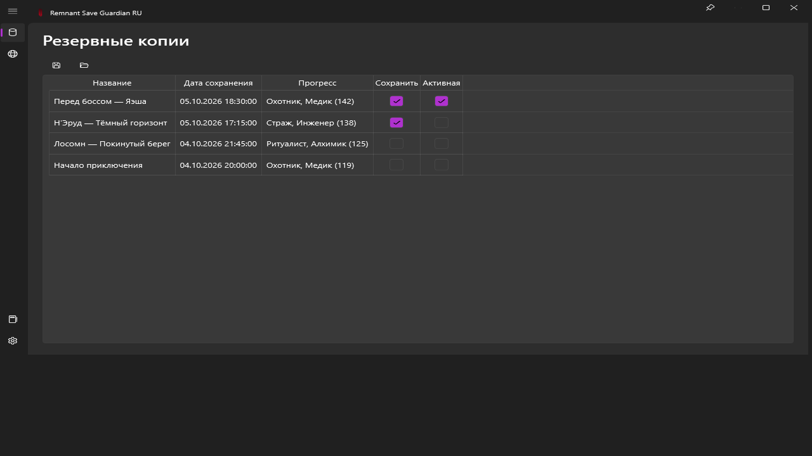
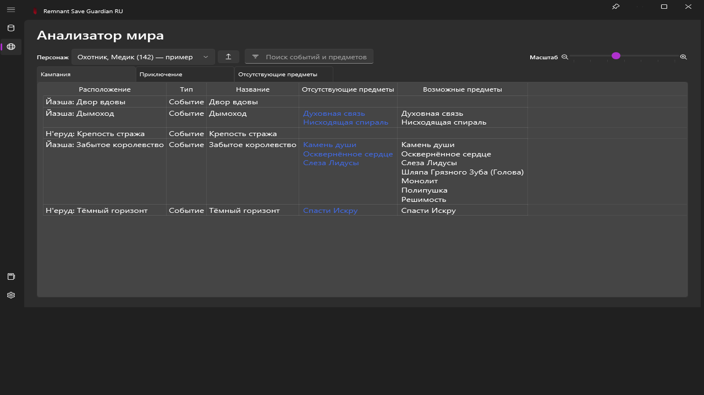
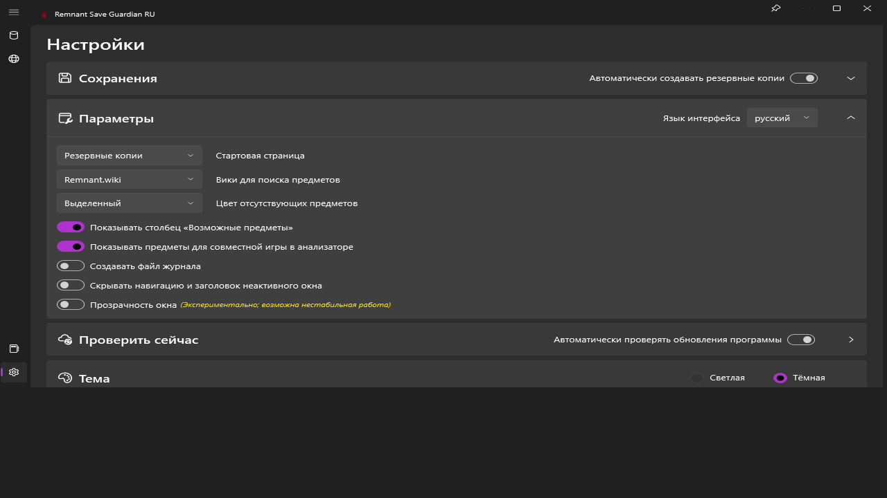

# Remnant Save Guardian RU

Резервное копирование сохранений Remnant II и анализ сгенерированных миров — с русским интерфейсом, названиями предметов, событий и подсказками.

Русская версия [Remnant Save Guardian](https://github.com/Razzmatazzz/RemnantSaveGuardian), основанная на версии 1.4.2. Сохранены функции и оформление исходного приложения. Русский язык выбран по умолчанию; другие языки можно включить в настройках.

**Анализатор наследует ограничения исходного проекта: некоторые события и предметы могут определяться неточно.**

## Установка

1. Откройте [последний релиз](https://github.com/PavelZagumenkin/Remnant2SaveManager_Razzmatazzz_RU/releases/latest).
2. Скачайте архив `RemnantSaveGuardianRU-1.4.3-win-x64.zip`.
3. Распакуйте **весь архив** в отдельную папку, например `C:\Games\RemnantSaveGuardianRU`.
4. Запустите `RemnantSaveGuardian.exe`.
5. Проверьте папки сохранений и резервных копий в разделе **Настройки → Сохранения**.

Архив предназначен для 64-разрядной Windows 10/11 и включает .NET 8: отдельная установка среды выполнения не требуется. Сохраняйте все файлы и подпапки архива, в том числе `ru`.

Подробная инструкция: [wiki на русском языке](https://github.com/PavelZagumenkin/Remnant2SaveManager_Razzmatazzz_RU/wiki).

## Возможности

- Ручное и автоматическое резервное копирование сохранений.
- Восстановление всех данных, только персонажей или только миров.
- Анализ кампании и приключения, поиск событий и предметов.
- Список отсутствующих и возможных предметов, включая данные DLC из оригинальной базы.
- Русские названия и подсказки по получению предметов.
- Настройки лимита копий, интервала, темы, масштаба и прозрачности.
- Проверка обновлений программы и игровых данных из этого репозитория.

## Скриншоты

Снимки получены из собранного WPF-интерфейса **русской версии**. Показаны демонстрационные данные, а не сохранения конкретного игрока.

### Резервные копии



### Анализатор мира



### Настройки



## Известные ограничения

- В исходной базе могут отсутствовать отдельные предметы.
- Некоторые события могут отображаться неверно; расположение добычи иногда приблизительное.
- Для неизвестных игре программы объектов возможно отображение технических идентификаторов.
- Антивирус или облачная синхронизация могут мешать работе с файлами сохранений.
- Экспериментальная прозрачность окна может работать нестабильно.

Перед восстановлением копии закройте игру. Подробности и решение типичных проблем: [Помощь](https://github.com/PavelZagumenkin/Remnant2SaveManager_Razzmatazzz_RU/wiki/Help). Сообщения об ошибках: [Issues](https://github.com/PavelZagumenkin/Remnant2SaveManager_Razzmatazzz_RU/issues).

## Сборка из исходников

Нужны Windows и [.NET 8 SDK](https://dotnet.microsoft.com/download/dotnet/8.0).

```powershell
dotnet restore RemnantSaveGuardian.sln
pwsh -File scripts/Verify-Localization.ps1
pwsh -File scripts/Build-Release.ps1
```

Архив и контрольная сумма создаются в `artifacts`. Инструкция по воспроизводимым скриншотам: [docs/DEVELOPMENT.md](docs/DEVELOPMENT.md).

## Лицензия

GNU GPL v3, как у исходного проекта; текст лицензии находится в [LICENSE](LICENSE). Исходная история Git и уведомления об авторских правах сохранены. Изменения русской версии: [CHANGELOG.md](CHANGELOG.md).
